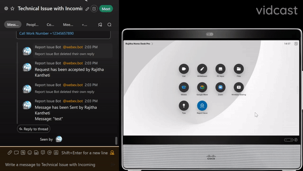

# Report Issue Macro Bot

Welcome to our WXSD DEMO Repo! <!-- Keep this here -->

Report Issue Macro is a Webex Device macro which lets a user select issue categories and enter issue details which are sent to a Webhook service

Report Issue Bot, gets a post request once the user starts the issue on the Webex device. On getting the post request, bot determines the appropriate team based on the issue and the team space receives a notification of the trouble on the user end. Then the team member can acknowledge the ownership and send message back to the device.

<p align="center">
   <a href="https://app.vidcast.io/share/c07b5af6-38b6-4ae9-9b3a-39633068fb23" target="_blank">
       
    </a>
</p>

## Table of Contents

<!-- ⛔️ MD-MAGIC-EXAMPLE:START (TOC:collapse=true&collapseText=Click to expand) -->
<details>
<summary>(click to expand)</summary>
    
  * [Usage](#usage)
  * [Setup](#setup)
  * [Installation](#installation)
  * [Demo](#demo)
  * [Validation](#validation)
  * [License](#license)  
  * [Disclaimer](#disclaimer)
  * [Questions](#questions)

</details>
<!-- ⛔️ MD-MAGIC-EXAMPLE:END -->

## Usage

- One can use the macro by adding the macro code to your device and clicking on the report issue icon on your device.
- One can use the Report Issue Bot by sending a post request to

```
curl --location --request POST 'https://report-issue.wbx.ninja/report-issue-bot-request' \
--header 'Content-Type: application/json' \
--data-raw '{
   "category": "",
   "description": "",
   "name": "",
   "identification": {
      "software": "",
      "deviceId": "",
      "contactNumber": ""
   }
}'
```

## Setup

### Macro

#### Prerequisites & Dependencies:

- Webex Device running RoomOS 9.15.x or above.
- Device Web Admin or Control Hub access to enable and upload the Macro.

### Bot

#### Prerequisites & Dependencies:

- Developed on Windows 11
- MongoDb (i.e Atlas)
- Node >18.15.0 (recommended)
- Other OS and node versions may work but not tested

Open a new terminal window and follow the instructions below to setup the project locally for development/demo.

1. Clone this repository and change directory:

   ```
   git clone https://github.com/wxsd-sales/report-issue-bot.git
   ```

2. Copy `.env.example` file as `.env`:
   ```
   cp .env.example .env
   ```

You will need to add values to **.env** file:

```
WEBEX_API_URL=https://webexapis.com/v1
WEBEX_ACCESS_TOKEN=

MONGO_URI=""
MONGO_DB=reportIssueBot
```

Note:

1. You will need to provide a PORT for this to run locally, if left empty, it runs on port 3000
2. Review and follow the [Creating a Webex Bot](https://developer.webex.com/docs/bots#creating-a-webex-bot) guide.
   Take note of your Bot access token. Assign this value to the `WEBEX_BOT_TOKEN` environment variable.

#### MongoDB Schema

If you are trying to create your own MongoDB, the schema looks as follows:

```
{
   "room_name":"Technical Issue with Incoming Audio/Video",
   "room_id":""
}
```

## Installation

### Macro

1. Download the `report-issue.js` file and upload it to your Webex Room device.
2. Configure the Macro by changing the initial values, there are comments explaining each one.
3. Enable the Macro.

### Bot

The typical npm install flow, after the setup

```
npm install
npm start
```

## Demo

\*For more demos & PoCs like this, check out our [Webex Labs site](https://collabtoolbox.cisco.com/webex-labs).

## Validation

Validated Hardware:

- Webex Room Kit Pro
- Webex Desk Pro

## License

All contents are licensed under the MIT license. Please see [license](LICENSE) for details.

## Disclaimer

Everything included is for demo and Proof of Concept purposes only. Use of the site is solely at your own risk. This site may contain links to third party content, which we do not warrant, endorse, or assume liability for. These demos are for Cisco Webex usecases, but are not Official Cisco Webex Branded demos.

## Questions

Please contact the WXSD team at [wxsd@external.cisco.com](mailto:wxsd@external.cisco.com?subject=report-issue-macro-bot) for questions. Or, if you're a Cisco internal employee, reach out to us on the Webex App via our bot (globalexpert@webex.bot). In the "Engagement Type" field, choose the "API/SDK Proof of Concept Integration Development" option to make sure you reach our team.
